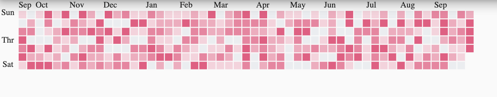

# github_calendar

A calendar view like github repo contributions.



## Getting Started

```yml
   github_calendar: ^0.0.2
```

## Usage

```dart
Container(
  height: 200,
  child: GithubCalendar(
    color: Colors.pink,
    data: List.generate(371, (index){
      return Random().nextInt(5);
      }),
    )
  )
```

